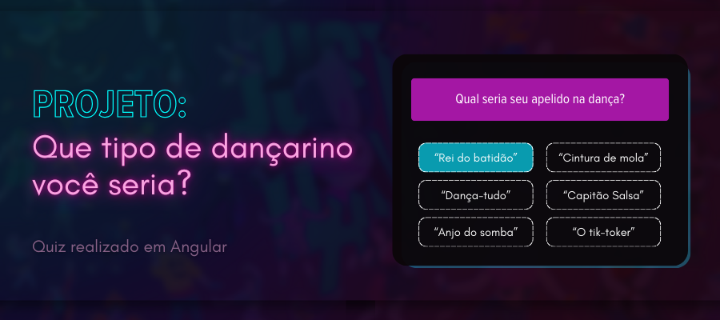

## 

 

## 💻 Sobre este projeto
Você é daqueles que joga pra lua ou prefere ritmos lentos? Que tipo de dançarino você seria? [Descubra agora!](https://dancequiz.netlify.app).

Este projeto foi elaborado como componente para a finalização do bootcamp "Front-end com Angular" pela plataforma DIO, tendo sido baseado no BuzzFeed e em seus famosos quizzes com os mais variados assuntos. 

Utilizando Angular, foi possível solidificar conhecimentos sobre a troca de dados entre diferentes componentes HTML e TypeScript e sobre o funcionamento geral do framework, além de melhorar o entendimento sobre funções, arquivos .json e regras *ng.

## 🎨 Funcionamento

O quiz conta com 6 perguntas que variam desde a canção perfeita para uma dança até "lemas de dança". Ao responder todas, você verá seu resultado e também poderá realizar o teste novamente.

Logo na parte superior, é possivel observar um emoji de nota musical (🎶). Ao tocá-lo, é possível escutar uma canção. Basta tocar novamente para pausá-la.

## 🔨 Tecnologias
* [Angular](https://angular.io/docs)
* [HTML](https://www.google.com/url?sa=t&rct=j&q=&esrc=s&source=web&cd=&cad=rja&uact=8&ved=2ahUKEwjjrfzr1sCEAxUHqJUCHa44BccQFnoECBsQAQ&url=https%3A%2F%2Fdeveloper.mozilla.org%2Fpt-BR%2Fdocs%2FWeb%2FHTML%2F&usg=AOvVaw1wNo3SpmAhJCzSSemiBnS4&opi=89978449)
* [JavaScript](https://www.google.com/url?sa=t&rct=j&q=&esrc=s&source=web&cd=&cad=rja&uact=8&ved=2ahUKEwjdhfOG18CEAxWXpZUCHf0OAiQQFnoECAcQAQ&url=https%3A%2F%2Fdeveloper.mozilla.org%2Fpt-BR%2Fdocs%2FWeb%2FJavaScript%2F&usg=AOvVaw3Qa22TGhpCR84ZNe18ud0R&opi=89978449)
* [Node.js](https://nodejs.org/)

## 🥺 Como contribuir para o projeto
De modo geral, você pode contribuir testando meus projetos e dando feedback :)
Caso esteja interessado em contribuir em novas implementações, siga estes passos:
1. Faça um **fork** do projeto;
2. Crie uma nova branch com as suas alterações: `git checkout -b my-feature`
3. Salve as alterações e crie uma mensagem de commit contando o que você fez: `git commit -m "feature: My new feature"`
4. Envie as suas alterações: `git push origin my-feature`

> Caso tenha alguma dúvida, confira este guia de [como contribuir no GitHub](https://github.com/firstcontributions/first-contributions?tab=readme-ov-file)

***

Feito com ❤️ por Carlos Azevedo 👋🏽 [Entre em contato!](https://www.linkedin.com/in/carlos-as-azevedo/)
